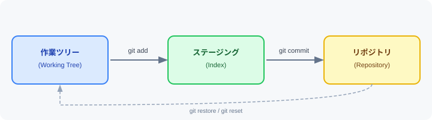

# ➕ 3. ファイルのステージング

> **概要:** 変更したファイルをコミット対象として登録（ステージング）します。



---

## 📋 手順

### 1. 特定のファイルをステージングする

```bash
git add ファイル名
```

### 2. 複数のファイルをまとめてステージングする

```bash
git add ファイル1 ファイル2
```

### 3. すべての変更をステージングする

```bash
git add .
```

### 4. ステージング状態を確認する

```bash
git status
```

---

## 🔄 ステージングの概念

| 場所 | 説明 |
|------|------|
| **作業ツリー** | ファイルを実際に編集する場所 |
| **ステージング（インデックス）** | 次のコミットに含める変更を登録する中間エリア |
| **リポジトリ** | コミットが永続的に記録される場所 |

---

> 💡 **ヒント:** ステージングは「次のコミットに含める変更を選ぶ」操作です。  
> `git add .` はカレント ディレクトリ以下のすべての変更を対象にします。  
> 特定のファイルだけを選んでコミットしたいときは、ファイル名を明示してください。

---

[← 前のセクション: リポジトリの作成](section2.md) ｜ [← マニュアル トップへ](gitmanual.md) ｜ [次のセクションへ → コミットの作成](section4.md)
