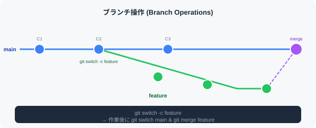

# 🌿 8. ブランチ操作

> **概要:** ブランチを使って、作業を分岐・切り替えします。



---

## 📋 手順

### 1. ブランチの一覧を表示する

```bash
git branch
```

### 2. 新しいブランチを作成する

```bash
git branch ブランチ名
```

### 3. ブランチを切り替える

```bash
git switch ブランチ名
```

### 4. ブランチの作成と切り替えを同時に行う

```bash
git switch -c ブランチ名
```

### 5. ブランチを削除する

```bash
git branch -d ブランチ名
```

---

## 🔄 ブランチ操作のよくある流れ

```bash
# 1. 新しいブランチを作成して切り替え
git switch -c feature/new-function

# 2. 作業・コミット
git add .
git commit -m "feat: 新機能を追加"

# 3. メイン ブランチに戻ってマージ
git switch main
git merge feature/new-function

# 4. 不要になったブランチを削除
git branch -d feature/new-function
```

---

## 📊 ブランチ コマンド一覧

| コマンド | 説明 |
|---------|------|
| `git branch` | ローカル ブランチ一覧 |
| `git branch -a` | リモート含む全ブランチ一覧 |
| `git branch -v` | 最新コミット付き一覧 |
| `git branch -d ブランチ名` | マージ済みブランチを削除 |
| `git branch -D ブランチ名` | 強制削除 |

---

> 💡 **ヒント:** ブランチを活用すると、機能追加やバグ修正を独立して進められます。  
> `main` ブランチを直接編集せず、作業は必ず別ブランチで行うことをお勧めします。

---

[← 前のセクション: 差分の確認](section7.md) ｜ [← マニュアル トップへ](gitmanual.md) ｜ [次のセクションへ → マージ](section9.md)
