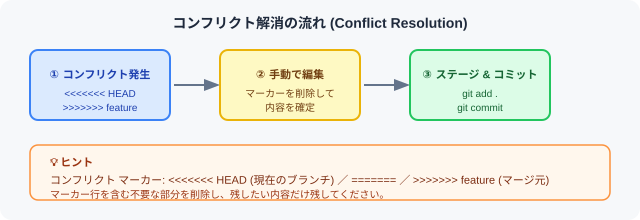

# 🔀 9. マージ

> **概要:** 別のブランチの変更を現在のブランチに統合します。



---

## 📋 手順

### 1. 統合先のブランチに切り替える

```bash
git switch main
```

### 2. 対象ブランチをマージする

```bash
git merge ブランチ名
```

### 3. コンフリクトが発生した場合、該当ファイルを手動で編集する

```
<<<<<<< HEAD
現在のブランチの内容
=======
マージ元ブランチの内容
>>>>>>> feature
```

### 4. 編集後、ステージしてコミットする

```bash
git add .
git commit -m "コンフリクト解消"
```

---

## 🔄 マージの種類

| 種類 | 説明 | コマンド例 |
|------|------|-----------|
| **Fast-forward** | 分岐なしで直線的に統合 | `git merge feature` |
| **3-way merge** | 分岐がある場合にマージ コミットを作成 | `git merge feature` |
| **Squash merge** | すべての変更を 1 コミットにまとめてマージ | `git merge --squash feature` |
| **Rebase** | コミット履歴を直線に整形 | `git rebase main` |

---

> 💡 **ヒント:** コンフリクト発生時は、`<<<<<<<` と `>>>>>>>` のマーカーを目印に修正してください。  
> マージを中断したい場合は `git merge --abort` で取り消せます。

---

[← 前のセクション: ブランチ操作](section8.md) ｜ [← マニュアル トップへ](gitmanual.md) ｜ [次のセクションへ → 変更の取り消し](section10.md)
